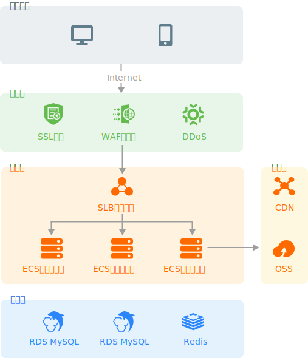

# 部署

:::warning
本章内容没有真正的实践过，仅提供理论支持，在实践过程中请注意是否能正确部署
:::

## 项目构建和环境部署

使用 **Docker** 进行项目构建和环境部署，所有的构建和部署操作，均在 **Jenkins** 执行操作。

主要依赖于下面两个镜像：

- [Node.js](https://nodejs.org/)：用于安装依赖、构建和启动
- [nginx](https://nginx.org/)：作为 HTTP 服务器，或者充当的反向代理

构建和部署时，注意检查下列配置：

- Node.js：推荐使用 LTS 版本
  - 优先使用现代模式构建依赖
- nginx：推荐使用 stable 版本
  - 配置路由伪静态（History 路由模式专属）
  - 配置 HTTP 缓存
  - 配置 Gzip 压缩
  - 配置 Brotli 压缩
  - 配置 HTTP 安全 Header
  - 配置 HTTPS
  - 配置 [ModSecurity](https://github.com/SpiderLabs/ModSecurity) 防火墙（可选）
  - 配置反向代理（Nuxt.js 项目专属）

:::tip
参见 [nginx 配置](/docs/reference/configuration/#nginx)
:::

### Vue

- Node.js
  - 执行 `npm install` 安装依赖
  - 执行 `npm run build` 构建项目
  - 构建完成后生成 `/dist` 目录
- nginx
  - 编译 [Brotli nginx 模块](https://github.com/google/ngx_brotli)
  - 编译 [ModSecurity nginx 模块](https://github.com/SpiderLabs/ModSecurity-nginx)（可选）
  - 将编译完成后模块复制到 nginx 的模块目录
  - 复制 `/dist` 目录到 nginx 的服务器目录
  - 复制 `nginx.conf` 文件替换镜像的 nginx 配置文件
  - 执行 `nginx -s reload` 重新加载 nginx 配置

:::tip
参见 [Docker#Vue](/docs/reference/configuration/#vue)
:::

### Nuxt.js

- Node.js
  - 执行 `npm install` 安装依赖
  - 执行 `npm install -g pm2` 安装 [PM2](https://pm2.keymetrics.io/)
  - 执行 `pm2 start` 启动项目
- nginx
  - 编译 [Brotli nginx 模块](https://github.com/google/ngx_brotli)
  - 编译 [ModSecurity nginx 模块](https://github.com/SpiderLabs/ModSecurity-nginx)（可选）
  - 将编译完成后模块复制到 nginx 的模块目录
  - 复制 `nginx.conf` 文件替换镜像的 nginx 配置文件
  - 执行 `nginx -s reload` 重新加载 nginx 配置

:::tip
参见 [Docker#Nuxt.js](/docs/reference/configuration/#nuxt-js)
:::

## 服务器架构推荐

服务器产品推荐使用[阿里云](https://cn.aliyun.com/)产品

### 安全层

- [SSL 证书](https://www.aliyun.com/product/cas)：为网站提供 HTTPS 访问，保障数据的安全
- [DDoS 防护](https://www.aliyun.com/product/security/ddos)：降低潜在DDoS攻击风险，减少业务损失
- [Web 应用防火墙 WAF](https://www.aliyun.com/product/waf)：避免网站服务器被恶意入侵，保障业务的核心数据安全

### 应用层

- [负载均衡 SLB](https://www.aliyun.com/product/slb)：通过对多台云服务器进行均衡的流量分发调度，消除单点故障提升应用系统的可靠性与吞吐力
- [云服务器 ECS](https://www.aliyun.com/product/ecs)：部署 HTTP 服务器和项目代码
  - CPU 内存比为 1:2，推荐使用 2vCPU 和 4GB 内存以上配置
  - 推荐使用 5MB 带宽
  - 建议支持 IPv6
  - 推荐使用 [Rocky Linux](https://rockylinux.org/) 或 [AlmaLinux](https://almalinux.org/) 操作系统

### 存储层

- [CDN](https://www.aliyun.com/product/cdn)：部署静态资源，将网站、音视频、下载等内容分发至接近用户的节点，使用户可就近取得所需内容，提高用户访问的响应速度和成功率
- [对象存储 OSS](https://www.aliyun.com/product/oss)：优化资源存储成本

### 数据层

（数据层不是前端关注的重点，这里不做说明）
