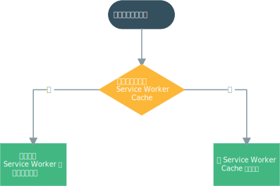
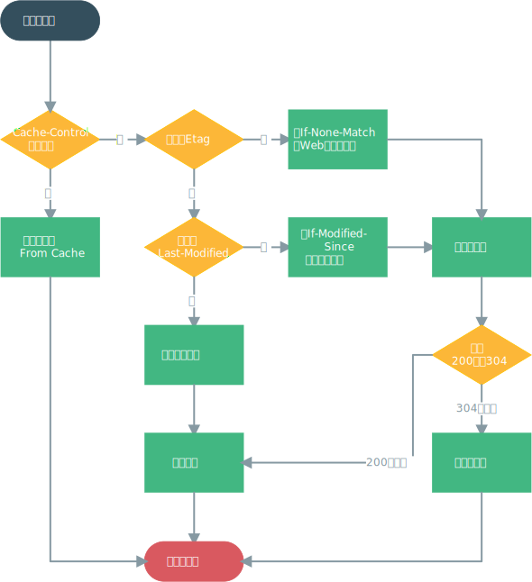

# 性能优化

[[toc]]

## 服务器

### HTTP 缓存

通过网络获取内容既速度缓慢又开销巨大。较大的响应需要在客户端与服务器之间进行多次往返通信，这会延迟浏览器获得和处理内容的时间，还会增加访问者的流量费用。因此，HTTP 缓存并重复利用之前获取的资源的能力成为性能优化的一个关键方面。

HTTP 缓存的优先级如下：

- Service Worker Cache
- HTTP Cache
- Push Cache

#### Service Worker Cache

Service Worker Cache 实际上是 [Service Worker](https://developer.mozilla.org/zh-CN/docs/Web/API/Service_Worker_API) 和 [CacheStorage API](https://developer.mozilla.org/zh-CN/docs/Web/API/CacheStorage) 两项技术。Service Worker 允许用户拦截网络请求，并通过 CacheStorage API 有条件的将项目存储在一个特殊的缓存中。此缓存与浏览器的本地缓存分开，使用它即可在用户出于弱网络（甚至离线）时，从 CacheStorage 缓存向用户提供内容。还可以使用这个特殊时期的缓存提高渲染性能。



:::tip
Service Worker Cache 实际上是 PWA 的一个功能，有一个库 [Workbox](https://developers.google.com/web/tools/workbox) 可以实现此功能。在 Vue 项目中可以使用 [PWA 插件](https://cli.vuejs.org/zh/config/#pwa) 来开启 Workbox。
:::

#### HTTP Cache



##### Cache-Control

[Cache-Control](https://developer.mozilla.org/zh-CN/docs/Web/HTTP/Headers/Cache-Control) 用于控制缓存是否过期，若命中则直接从缓存中获取资源，**不会再与服务端发生通信**。

:::tip
为保证更新服务器资源文件时，资源不会因为读取缓存而导致更新失效，请确保使用输出文件内容的 Content Hash（如 `main.6ddc5bc2.chunk.js`）
:::

##### Expires

[Expires](https://developer.mozilla.org/zh-CN/docs/Web/HTTP/Headers/Expires) 与 Cache-Control 效果一致，但是优先级不如 Cache-Control，可以与 Cache-Control 搭配使用

##### Etag 和 Last-Modified

[ETag](https://developer.mozilla.org/zh-CN/docs/Web/HTTP/Headers/ETag) HTTP 响应头是资源的特定版本的标识符。如果资源请求的响应头里含有 ETag, 客户端可以在后续的请求的头中带上 [If-None-Match](https://developer.mozilla.org/zh-CN/docs/Web/HTTP/Headers/If-None-Match) 头来验证缓存。

[Last-Modified](https://developer.mozilla.org/zh-CN/docs/Web/HTTP/Headers/Last-Modified) 响应头可以作为一种弱校验器。说它弱是因为它只能精确到一秒。如果响应头里含有这个信息，客户端可以在后续的请求中带上 [If-Modified-Since](https://developer.mozilla.org/zh-CN/docs/Web/HTTP/Headers/If-Modified-Since) 来验证缓存。

当向服务端发起缓存校验的请求时（缓存协商），服务端会返回 200 ok表示返回正常的结果或者 304 Not Modified(不返回body)表示浏览器可以使用本地缓存文件。304的响应头也可以同时更新缓存文档的过期时间。

#### Push Cache

Push Cache 是指 HTTP2 在 server push 阶段存在的缓存。

### HTTP 压缩

基于文本的资源应与压缩一起使用，以最大程度地减少网络总字节数。

HTTP 压缩应该基于以下条件：

- 基于文本的资源类型。
- `Content-Encoding` 响应头设置为 `br`，`gzip` 或 `deflate`。

如果浏览器支持，则将服务器配置为使用 [Brotli](https://zh.wikipedia.org/wiki/Brotli) 压缩响应。 Brotli 是较新的压缩格式，其压缩效率比 GZIP 提升约 20%。

使用 [GZIP](https://www.gnu.org/software/gzip/) 作为 Brotli 的后备压缩支持。

:::tip
参见 [Brotli & GZIP 配置](/docs/reference/configuration#brotli--gzip-配置)
:::

:::warning
过高的压缩级别会对 CPU 造成较大的负载，在 nginx，可以使用 [brotli_static](https://github.com/google/ngx_brotli#brotli_static) 和 [gzip_static](https://nginx.org/en/docs/http/ngx_http_gzip_static_module.html) 减少 CPU 的压力。
:::

### HTTP/2

HTTP/2 可以更快地为页面的资源提供服务，并且通过网络传输的数据更少。

:::tip
参见 [HTTP/2 配置](/docs/reference/configuration#http2-配置)
:::

#### 请求与响应复用

在 HTTP/1.x 中，如果客户端要想发起多个并行请求以提升性能，则必须使用多个 TCP 连接。 这是 HTTP/1.x 交付模型的直接结果，该模型可以保证每个连接每次只交付一个响应（响应排队）。 更糟糕的是，这种模型也会导致队首阻塞，从而造成底层 TCP 连接的效率低下。

HTTP/2 中新的二进制分帧层突破了这些限制，实现了完整的请求和响应复用：客户端和服务器可以将 HTTP 消息分解为互不依赖的帧，然后交错发送，最后再在另一端把它们重新组装起来。

将 HTTP 消息分解为独立的帧，交错发送，然后在另一端重新组装是 HTTP 2 最重要的一项增强。事实上，这个机制会在整个网络技术栈中引发一系列连锁反应，从而带来巨大的性能提升，让我们可以：

- 并行交错地发送多个请求，请求之间互不影响。
- 并行交错地发送多个响应，响应之间互不干扰。
- 使用一个连接并行发送多个请求和响应。
- 不必再为绕过 HTTP/1.x 限制而做很多工作（例如级联文件、image sprites 和域名分发）。
- 消除不必要的延迟和提高现有网络容量的利用率，从而减少页面加载时间。
- 等等…

HTTP/2 中的新二进制分帧层解决了 HTTP/1.x 中存在的队首阻塞问题，也消除了并行处理和发送请求及响应时对多个连接的依赖。 结果，应用速度更快、开发更简单、部署成本更低。

#### headers 压缩

每个 HTTP 传输都承载一组标头，这些标头说明了传输的资源及其属性。 在 HTTP/1.x 中，此元数据始终以纯文本形式，通常会给每个传输增加 500–800 字节的开销。如果使用 HTTP Cookie，增加的开销有时会达到上千字节。 为了减少此开销和提升性能，HTTP/2 使用 HPACK 压缩格式压缩请求和响应标头元数据，这种格式采用两种简单但是强大的技术：

- 这种格式支持通过 HPACK 对传输的标头字段进行编码，从而减小了各个传输的大小。
- 这种格式要求客户端和服务器同时维护和更新一个包含之前见过的标头字段的索引列表（换句话说，它可以建立一个共享的压缩上下文），此列表随后会用作参考，对之前传输的值进行有效编码。

注：在 HTTP/2 中，请求和响应标头字段的定义保持不变，仅有一些微小的差异：所有标头字段名称均为小写，请求行现在拆分成各个 `:method`、`:scheme`、`:authority` 和 `:path` 伪标头字段。

#### Server Push

HTTP/2 新增的一个强大的新功能是，服务器可以对一个客户端请求发送多个响应。 换句话说，除了对最初请求的响应外，服务器还可以向客户端推送额外资源，而无需客户端明确地请求。

推送资源可以进行以下处理：

- 由客户端缓存
- 在不同页面之间重用
- 与其他资源一起复用
- 由服务器设定优先级
- 被客户端拒绝

#### HTTP/2 反模式

有一些在 HTTP/1.x 下的一些性能优化，在 HTTP/2 下会起到反作用，应该避免使用。

##### 域名拆分

域名拆分是为了利用浏览器对每个域名开启多个连接的能力，以便实现资源并行下载，绕过 HTTP/1.x 串行化下载的限制。因为 HTTP/2 采取了多路复用，所以域名拆分反而是不必要的，并且会让协议力图实现的目标落空。

##### 资源内联

资源内联的目的是省掉加载外部资源所需的新连接和请求响应时间。然而，这是以损失缓存为代价。如果有一个页面上的重复访问，缓存通常可以减少重复请求数（而且能够加快页面渲染）。

:::tip
使用 HTTP/2 的一般原则是避免内联，但是内联也并不一定毫无价值
:::

##### 资源合并

资源合并意味着把几个小文件合并成一个大文件，省掉那些加载外部资源的相应时间，以及解码/执行那些资源所消耗的 CPU 资源。因为 HTTP/2 采取了多路复用，加载多个文件已经不再是性能瓶颈，并且可以让文件更加快速的下载。

:::tip
如何处理？全部交给 Webpack 处理就行了！
:::

##### 禁用 cookie 的域名

禁用 cookie 的域名来提供静态资源是一项标准的性能优化实践。尤其是使用 HTTP/1.x 时，无法压缩首部，而 cookie 的大小又常常超过单个 TCP 数据包的限度。不过，在 HTTP/2 下，请求首部使用 HPACK 算法被压缩，会显著减少巨型 cookie 的字节数（尤其是当它在先后请求之间保持不变）。与此同时，禁用 cookie 的域名需要额外的域名，这意味着额外的链接。

:::tip
如果仅仅是提供静态资源的 CDN，可以禁用 cookie
:::

##### 生成精灵图

生成精灵图是一种避免小资源请求过多的技术，把较小的图片拼合成较大的图片，通过 CSS 把图片的某个部分展示出来。即便如此，精灵图的开发体验很糟糕，特别是图标更新的时候将重新加载文件。如果用 HTTP/2，最佳实践就是避免生产精灵图，HTTP/2 采取了多路复用和首部压缩去掉了较大的请求开销。

## 资源加载

### CDN

内容交付网络（CDN）通过使用服务器的分布式网络将资源交付给用户来提高站点性能。 因为 CDN 减少了服务器负载，所以它们减少了服务器成本，非常适合处理流量高峰。

CDN 由服务器网络组成，这些服务器网络经过优化，可快速将内容交付给用户。尽管可以说 CDN 以提供缓存的内容而闻名，但 CDN 也可以改善不可缓存的内容的传递。一般来说，CDN 提供的网站资源越多越好。

CDN 可以将资源基于地理位置提供给临近的用户，以此提升性能。


:::tip
参见[阿里云 CDN 文档](https://www.alibabacloud.com/help/zh/product/27099.html)
:::

### 优先分配资源

并非所有通过网络发送到浏览器的字节都具有相同的重要性，浏览器也知道这一点。浏览器具有试探法，试图首先猜测最重要的资源，例如在脚本和图像之前放置CSS。

也就是说，与任何启发式方法一样，它并不总是可行的。浏览器可能会做出错误的决定，通常是因为当时没有足够的信息。可以使用 `<link rel="preload">`，`<link rel="preconnect">` 和 `<link rel="prefetch">` 等多种方式影响这一策略。

浏览器根据它们的重要性来为不同类型的资源分配不同的相对优先级。因此，例如，页面 `<head>` 中的 `<script>` 标签将以高优先级（低于CSS，处于最高）加载到Chrome中，但是如果它具有 `async` 属性，则该优先级将变为低。加载并异步运行）。

这些优先级让您了解浏览器属性对每种资源的相对重要性。请记住，细微的差别足以使浏览器分配不同的优先级。例如，作为初始渲染一部分的图像的优先级要高于屏幕外开始的图像。

- `<link rel="preload">` 通知浏览器，当前导航需要一部分资源，并且应该尽快开始获取该资源。
- `<link rel="preconnect">` 通知浏览器您的页面打算与另一个来源建立连接，并且您希望该过程尽快开始。
- `<link rel="prefetch">` 与 `<link rel="preload">` 和 `<link rel="preconnect">` 有所不同，因为它并不试图使关键的事情更快地发生。相反，如果有机会，它会尽早使一些非关键事件发生。

### 预加载关键资产以提高加载速度

当打开网页时，浏览器从服务器请求 HTML 文档，解析其内容，并对任何引用的资源提交单独的请求。开发人员已经知道页面需要的所有资源以及其中最重要的资源。可以使用这些知识提前请求关键资源并加快加载过程。使用`<link rel="preload">`实现这一目标。

通过预加载某种资源，您就是在告诉浏览器您要比其他方式发现它更快地获取它，因为您确定它对于当前页面很重要。

可以通过在 HTML 文档的开头添加带有 `rel="preload"` 的 `<link>` 标记来预加载资源：

```html
<link rel="preload" as="script" href="critical.js">
```

浏览器会缓存预加载的资源，以便在需要时立即可用。（它不执行脚本或应用样式表）

#### 预加载CSS中定义的资源

在浏览器下载并解析这些 CSS 文件之前，不会发现使用 `@font-face` 规则定义的字体或 CSS 文件中定义的背景图像。预加载这些资源可确保在下载 CSS 文件之前将其获取。

#### 预加载CSS文件

如果使用关键的 CSS 方法，则将 CSS 分为两部分。 呈现首屏内容所需的关键 CSS 内联在文档的 `<head>` 中，非关键 CSS 通常是用 JavaScript 延迟加载的。 在加载非关键 CSS 之前等待 JavaScript 执行可能会导致用户滚动时渲染延迟，因此最好使用 `<link rel="preload">` 更快地开始下载。

#### 预加载JavaScript文件

由于浏览器不执行预加载的文件，因此预加载对于将获取与执行分开是很有用的，这可以改善诸如“交互时间”之类的指标。如果您拆分 JavaScript 包并且仅预加载关键块，则预加载效果最好。

### 尽早建立网络连接以提高感知的页面速度

浏览器必须先建立连接，然后浏览器才能从服务器请求资源。 建立安全连接包括三个步骤：

- 查找域名并将其解析为IP地址。
- 建立与服务器的连接。
- 加密连接以确保安全。

在上述每个步骤中，浏览器都会向服务器发送一条数据，然后服务器将响应发送回去。从起点到目的地再到终点的旅程称为往返。

根据网络条件，一次往返可能会花费大量时间。连接设置过程可能涉及多达三个往返行程，而在未优化的情况下则可能更多。

提前做好所有准备工作，会使应用程序感觉更快。通过两个资源提示实现此目的：`<link rel="preconnect">` 和 `<link rel="dns-prefetch">`。

#### 使用`rel="preconnect"`尽早建立连接

现代浏览器会尽力预见页面需要哪些连接，但无法可靠地预测所有连接。

将 `rel="preconnect"` 添加到 `<link>` 会通知浏览器您的页面打算与另一个域建立连接，并且您希望该过程尽快开始。资源将更快地加载，因为在浏览器请求时，设置过程已经完成。

资源提示之所以获得其名称，是因为它们不是强制性说明。它们提供有关您想要发生的事情的信息，但最终要由浏览器决定是否执行它们。建立并保持连接打开是一项繁重的工作，因此浏览器可能会根据情况选择忽略资源提示或部分执行它们。

通知浏览器您的意图就像在页面上添加 `<link>` 标记一样简单：

```html
<link rel="preconnect" href="https://example.com">
```


通过与重要的第三方来源建立早期连接，可以将加载时间缩短100–500 ms。 这些数字看似很小，但它们在用户对网页性能的感知方式上却有所不同。

##### 知道从哪里而来，而不是从哪里获取

由于版本依赖性，有时您会遇到这样的情况，即您知道将要从特定 CDN 请求资源，而不是确切的路径。

另一种常见情况是从映像CDN加载映像，其中映像的确切路径取决于媒体查询或用户浏览器上的运行时功能检查。

在这种情况下，如果要获取的资源很重要，则希望通过预连接到服务器来节省尽可能多的时间。浏览器在页面请求之前不会下载文件，但是至少它可以提前处理连接方面，从而使用户不必等待几次往返。

##### 流媒体预链接

流媒体来源不同时，您可能希望在连接阶段节省一些时间，而不必立即开始检索内容的另一个示例。

根据页面处理流内容的方式，您可能要等到脚本加载完毕并准备处理流。 预连接可帮助您在准备开始获取数据时将等待时间缩短至单程。

#### 使用`rel="dns-prefetch"`早期解析域名

您可以通过名称来记住站点，但是服务器可以通过 IP 地址来记住它们。 这就是为什么存在 DNS 的原因。 浏览器使用 DNS 将站点名称转换为 IP 地址。此过程-“域名解析”-是建立连接的第一步。

如果页面需要建立与许多第三方域的连接，则预先连接所有这些都是适得其反的。预连接提示最好仅用于最关键的连接。对于所有其他内容，使用`<link rel="dns-prefetch">` 可以节省第一步DNS查找的时间，通常大约需要 20-120 毫秒。

DNS解析的启动类似于预连接：通过在文档的 `<head>` 中添加 `<link>` 标记。

```html
<link rel="dns-prefetch" href="http://example.com">
```

浏览器对 `dns-prefetch` 的支持与 `preconnect` 支持略有不同，因此 `dns-prefetch` 可以作为不支持预连接的浏览器的后备。

```html
<link rel="preconnect" href="http://example.com">
<link rel="dns-prefetch" href="http://example.com">
```

### 预取资源以加速将来的导航

更快的加载时间可带来更高的转换率和更好的用户体验。可以通过提前下载这些页面的资源来缩短将来导航的加载时间。

使用`<link rel="prefetch">`实现此目的，该资源提示使您能够以简单有效的方式实现预取。

在网页上添加`<link rel="prefetch">`会告诉浏览器下载用户将来可能需要的整个页面或某些资源（例如脚本或CSS文件）。 这可以改善“首次内容丰富的绘画”和“互动时间”等指标，并且通常可以使后续导航看起来立即可以加载。

```html
<link rel="prefetch" href="style.css" as="style">
```


预取提示会消耗不立即需要的资源额外的字节，因此需要谨慎地应用此技术。仅在确信用户将需要资源时才预取资源。当用户的连接速度较慢时，请考虑不预取。可以使用 [Network Information API](https://developer.mozilla.org/zh-CN/docs/Web/API/NetworkInformation) 进行检测。

#### 预取后续页面

当可以预测后续页面时，请预取 HTML 文档，以便在单击链接时立即加载该页面。

例如，在产品列表页面中，您可以预取列表中最受欢迎的产品页面。 在某些情况下，下一次导航甚至更容易预期-在购物车页面上，用户访问结帐页面的可能性通常很高，这使其成为预取的理想选择。

#### 预取按需JavaScript块

通过代码拆分JavaScript bundle，可以最初仅加载应用程序的一部分，然后延迟加载其余部分。如果正在使用此技术，则可以将预取应用于不是立即需要但可能很快就会请求的路由或组件。

例如，如果您的页面包含一个按钮，该按钮会打开一个包含表情符号选择器的对话框，则可以将其分为三个 JavaScript 块：主Home、Dialog 和 Picker。 Home 和 Dialog 可以最初加载，而 Picker 可以按需加载。 诸如 webpack 之类的工具可让您指示浏览器预取这些按需块。

:::tip
对于 React 项目来说，可以使用路由结合代码拆分，预取后续路由文件
:::

## 图片/视频

### 使用 Imagemin 压缩图像

图片是网页加载中比较消耗资源的项目，未压缩的图像会在页面上消耗不必要带宽。

Imagemin 是图像压缩的绝佳选择，因为它支持多种图像格式，并且易于与构建脚本和构建工具集成。 Imagemin 可作为 [CLI](https://github.com/imagemin/imagemin-cli) 和 [npm 模块](https://www.npmjs.com/package/imagemin)使用。

[imagemin-webpack-plugin](https://github.com/Klathmon/imagemin-webpack-plugin) 是一个简单 Webpack 的插件，使用 Imagemin 压缩项目中的所有图像。

:::tip
参见 [Imagemin 图片压缩配置](/docs/reference/configuration#imagemin-图片压缩配置)
:::

### 用视频替换 GIF 动画，以加快页面加载速度

通过将大型 GIF 转换为视频，可以节省大量用户带宽。 使用 HTML5 视频，可以将 GIF 的体积减小，同时仍然保留浏览器中 GIF 格式的独特品质。

[ffmpeg](https://www.ffmpeg.org/) 是一个免费的开源命令行工具，专为处理视频和音频文件而设计。它可用于将 GIF 动画转换为视频格式。

将 GIF 转换为 WebM/MP4/Ogg：

```bash
ffmpeg -i animated.gif -b：v 0 -crf 25 -f mp4 -vcodec libx264 -pix_fmt yuv420p video.mp4
ffmpeg -i animated.gif -c vp9 -b：v 0 -crf 41 video.webm
ffmpeg -i animated.gif -acodec libogg video.ogv
```

使用`<video>`元素代替动画GIF并不像 `` 元素那么简单。 动画GIF具有三个特征：

- 加载后它们会自动播放
- 它们连续循环
- 他们没有音轨

使用 `autoplay`、`loop` 和 `muted` 属性是必须的。 `playinline` 是在 iOS 中自动播放所必需的。`poster`属性可以指定占位符以占用`<video>`元素的空间，直到视频被延迟加载为止。

```html
<video autoplay loop muted playsinline poster="video-placeholder.jpg">
  <source src="video.webm" type="video/webm">
  <source src="video.ogv" type="video/ogg; codecs='theora, vorbis'">
  <source src="video.mp4" type="video/mp4">
  
</video>
```

### 延迟加载图像

延迟加载是一种根据需要而不是预先加载资源的策略。这种方法在初始页面加载期间释放了资源，并避免了加载从未使用过的资源。

#### 使用 loading 属性

:::warning
注意：该属性为实验性功能，请参见 [Can I use#Lazy loading via attribute for images & iframes](https://caniuse.com/loading-lazy-attr)
:::

可以使用 `loading` 属性完全推迟通过滚动可以达到的屏幕外图像和 iframe 的加载

```html

<iframe src="https://example.com" loading="lazy"></iframe>
```

以下是 `loading` 属性支持的值：

- `lazy`：延迟加载图像，直到它和视口接近到一个计算得到的距离，由浏览器定义。
- `eager`：立即加载图像，不管它是否在可视视口（visible viewport）之外（默认值）。

#### 使用 lazysizes

[lazysizes](https://github.com/aFarkas/lazysizes) 是最受欢迎的延迟加载图像库。它是一个脚本，可以在用户浏览页面时智能地加载图像，并确定用户很快会遇到的图像的优先级。 lazysizes 是一个不错的选择，因为它使用高性能的 [Intersection Observer API](https://developer.mozilla.org/zh-CN/docs/Web/API/Intersection_Observer_API)（如果可用）来检测页面元素的可见性。与使用事件处理程序之类的较早解决方案相比，这使其性能更高。

添加 lazysizes 很简单：

- 将 lazysizes 添加到页面
- 选择要延迟加载的图像
- 更新这些图像的 `` 或 `<picture>` 标签

##### 将 lazysizes 添加到页面

```js
// $ npm install lazysizes
// 可全局引入
import 'lazysizes';
```

##### 更新 `` 标签

更新 `` 标签时，需要进行了两项更改：

- 添加 `lazyload` class：这表示要 lazysizes 图像应该被延迟加载
- 将 `src` 属性更改为 `data-src`：是时候加载图像了，lazysizes 代码使用 `data-src` 属性中的值设置图像 `src` 属性

Before:

```html

```

After:

```html

```

##### 更新 `<picture>` 标签

更新 `<picture>` 标签时，需要进行了两项更改：

- 将 `lazyload` class 添加到 `` 标签中
- 将 `<source>` 标记 `srcset` 属性更改为 `data-srcset`

Before:

```html
<picture>
  <source type="image/webp" srcset="flower.webp">
  <source type="image/jpeg" srcset="flower.jpg">
  
</picture>
```

After:

```html
<picture>
  <source type="image/webp" data-srcset="flower.webp">
  <source type="image/jpeg" data-srcset="flower.jpg">
  
</picture>
```

### 延迟加载视频

与图像元素一样，您也可以延迟加载视频。视频通常会加载`<video>`元素。但是，如何延迟加载`<video>`取决于用例。让我们讨论一些需要不同解决方案的方案。

#### 对于无自动播放的视频

对于由用户启动播放的视频（即无`autoplay`的视频），可能需要在`<video>`元素上指定`preload`属性：

```html
<video controls preload="none" poster="video-placeholder.jpg">
  <source src="video.webm" type="video/webm">
  <source src="video.ogv" type="video/ogg; codecs='theora, vorbis'">
  <source src="video.mp4" type="video/mp4">
</video>
```

上面的示例使用值为 `none` 的 `preload` 属性，以防止浏览器预加载任何视频数据。 `poster` 属性为 `<video>` 元素提供一个占位符，该占位符将在视频加载时占用空间。这样做的原因是，加载视频的默认行为可能因浏览器而异：

- 在 Chrome 中，预加载的默认设置曾经是 `auto`，但是从 Chrome 64 开始，现在默认使用 `metadata`。即使这样，在桌面版 Chrome 上，也可以使用 Content-Range 标头预加载一部分视频。 Firefox，Edge 和 Internet Explorer 11 的行为类似。
- 与台式机上的 Chrome 一样，Safari 11.0 台式机版本将预加载一系列视频。从版本 11.2 开始，仅视频元数据被预加载。在 iOS 上的 Safari 中，永远不会预加载视频。
- 启用数据保护程序模式后，预加载默认为`none`。

由于浏览器关于预加载的默认行为不是一成不变的，因此明确表示可能是最好的选择。在用户启动播放的情况下，使用 `preload="none"` 是推迟在所有平台上加载视频的最简单方法。 `preload` 属性不是推迟视频内容加载的唯一方法。 使用视频预加载进行快速播放可能会为您提供一些思路和见解，以帮助您使用JavaScript进行视频播放。

### 提供响应图像

向移动设备提供桌面大小的图像可能会比需要多使用 2-4 倍的数据。代替“一刀切”的图像处理方法，而是为不同的设备提供不同的图像大小。

#### 提供多个图像版本

通常会提供3-5种不同尺寸的图像。提供更多的图像尺寸会更好地提高性能，但会占用服务器上的更多空间，并且需要编写更多的HTML。

指定多个图像版本，浏览器将选择最佳图像版本使用

Before

```html

```

After

```html

```

`` 标签的 [`src`](https://developer.mozilla.org/zh-CN/docs/Web/HTML/Element/img#attr-src)，[`srcset`](https://developer.mozilla.org/zh-CN/docs/Web/HTML/Element/img#attr-srcset) 和 [`size`](https://developer.mozilla.org/zh-CN/docs/Web/HTML/Element/img#attr-sizes) 属性都可以交互以实现最终结果。

:::tip
[响应式图片](https://developer.mozilla.org/zh-CN/docs/Learn/HTML/Multimedia_and_embedding/Responsive_images)
:::

### 提供尺寸正确的图像

按比例缩小图像，然后再将其添加到页面中。 该图像看起来不错，但是却浪费了用户的数据并损害了页面性能。

:::tip
不要按比例缩小图像，请[提供响应图像](#提供响应图像)
:::

### 使用 WebP 图像

WebP 图像比 JPEG 和 PNG 图像小（通常将文件大小减少 25-35％）。这样可以减小页面大小并提高性能。

WebP是 JPEG，PNG 和 GIF 图像的理想替代品。另外，WebP 提供无损压缩和有损压缩。在无损压缩中，不会丢失任何数据。有损压缩会减小文件大小，但会以降低图像质量为代价。

#### 将图像转换为 WebP

通常使用[Imagemin WebP plugin](https://github.com/imagemin/imagemin-webp)插件自动将图像转换为 WebP。参见[参考配置](/docs/reference/configuration/#imagemin-图片压缩配置)

```html

```

```css
.picture {
  background-image: url("picture.png?as=webp");
}
```

```js
import picture from './picture.png?as=webp'
```

在条件允许的情况下，还可以使用[图像CDN](#使用图像CDN优化图像)优化图像。

#### 使用 WebP 图片

将 WebP 提供给较新的浏览器，将备用图像提供给较旧的浏览器：

```html
<picture>
  <source type="image/webp" srcset="flower.webp">
  <source type="image/jpeg" srcset="flower.jpg">
  
</picture>
```

:::tip
- [`<picture>`](https://developer.mozilla.org/zh-CN/docs/Web/HTML/Element/picture)
- [`<source>`](https://developer.mozilla.org/zh-CN/docs/Web/HTML/Element/source)
- [``](https://developer.mozilla.org/zh-CN/docs/Web/HTML/Element/img)
:::

### 使用图像CDN优化图像

图像 CDN 在优化图像方面非常出色。切换到图像CDN可以节省 40-80％ 的图像文件大小。从理论上讲，仅使用构建脚本就有可能获得相同的结果，但是在实践中很少见。

图像 CDN 专门从事图像的转换，优化和传输。您也可以将它们视为用于访问和操作网站上使用的图像的 API。对于从图像 CDN 加载的图像，图像 URL 不仅指示要加载的图像，还指示大小，格式和质量等参数。这样可以轻松为不同的用例创建图像的变体。

与构建脚本相比，CDN 通常更适合于为每个单独的客户端创建大量定制的图像。


:::tip
阿里云 CDN 提供[图像处理](https://help.aliyun.com/document_detail/193591.html)功能，可以简化图片[格式转化](https://help.aliyun.com/document_detail/193593.html)、[压缩](https://help.aliyun.com/document_detail/193595.html)、[裁剪](https://help.aliyun.com/document_detail/193596.html)、[缩放](https://help.aliyun.com/document_detail/193598.html)、[旋转](https://help.aliyun.com/document_detail/193599.html)、[添加水印](https://help.aliyun.com/document_detail/193601.html)等操作
:::

## JavaScript

### 使用 PRPL 模式应用即时加载

PRPL 是首字母缩略词，它描述一种用于使网页加载并变得更快的模式：

- Push/Preload：推送（或预加载）最重要的资源。
- Render：尽快渲染初始路由
- Pre-cache：预缓存剩余资源
- Lazy load：延迟加载其他路由和非关键资源

#### Push/Preload

Push 是 HTTP/2 的一个特性，其允许服务器在客户端缓存中填充数据，通过一个叫服务器推送的机制来提前请求，当客户端再次尝试获取资源时就可以直接从缓存中获取到，不用再发请求了。

Preload 预加载是声明性的获取请求，它告诉浏览器尽快请求资源。 通过在HTML文档的开头添加带有 `rel="preload"` 的 `<link>` 标记来预加载关键资源：

```html
<link rel ="preload" as ="style" href ="css/style.css">
```

浏览器为资源设置了更合适的优先级，以便尝试尽快下载它，同时又不延迟 window.onload 事件。

:::tip
* [preload](https://developer.mozilla.org/zh-CN/docs/Web/HTML/Preloading_content)
* preconnect
* prefetch
* HTTP/2 Server Push
* DNS 预读取
:::

#### Render

为了改进 First Paint（首次绘制），Lighthouse 建议内联关键 JavaScript 并使用异步机制延迟其余部分，以及内联在上面使用的关键 CSS。通过消除往返服务器以获取渲染阻止资源的往返操作，可以提高性能。但是，从开发角度看，内联代码更难维护，并且无法由浏览器单独缓存。

改进 First Paint 的另一种方法是在服务器端呈现页面的初始HTML。当脚本仍在获取，解析和执行时，这将立即向用户显示内容。但是，这会大大增加HTML文件的有效负载，这可能会损害“交互时间”，或者损害应用程序变为交互状态并响应用户输入所花费的时间。

没有任何一种正确的解决方案可以减少应用程序中的 First Paint，并且只有在收益大于应用程序的权衡因素的情况下，才应考虑内联样式和服务器端渲染。

#### Pre-cache

通过充当代理，Service Workers 可以直接从缓存中获取资源，而无需在重复访问时从服务器获取。 这不仅使用户可以在脱机时使用应用程序，还可以缩短重复访问时的页面加载时间。

#### Lazy Load

如果通过网络发送太多数据，那么 Lighthouse 将显示审核失败。

这包括所有资源类型，但是大型 JavaScript 负载特别昂贵，因为浏览器需要花费很长时间来解析和编译它们。

要发送较小的 JavaScript 有效负载，其中仅包含用户最初加载应用程序时所需的代码，请按需拆分整个 bundle 和延迟 chunks。

在设法拆分 bundle 之后，请预加载更重要的 chunks。预加载可确保浏览器更快地获取和下载更多重要资源。

除了按需拆分和加载不同的 JavaScript chunks 外，如果在网页上加载许多图像，请在加载页面时推迟所有折页以下或设备视口之外的图像。

### 预加载（Preload）关键资源以提高加载速度

当打开网页时，浏览器从服务器请求HTML文档，解析其内容，并为任何引用的资源提交单独的请求。作为开发人员，知道页面需要的所有资源以及其中最重要的资源。 可以使用这些知识提前请求关键资源并加快加载过程。

预加载最适合通常由浏览器发现的资源。浏览器会缓存预加载的资源，以便在需要时立即可用。（它不执行脚本或应用样式表。）

通过预加载某种资源，就是在告诉浏览器要比其他方式发现它更快地获取它。

#### 使用 webpack 预加载 JavaScript 模块

对于 Webpack 4.6.0 或更高版本，通过在 `import()` 中使用[魔术注释](https://webpack.js.org/api/module-methods/#magic-comments)来支持预加载：

```javascript
import(/* webpackPreload: true */ "CriticalChunk");
```

如果使用的是旧版的 webpack，可使用第三方插件，例如 [preload-webpack-plugin](https://github.com/GoogleChromeLabs/preload-webpack-plugin)。

:::tip
参见 [Preload/Prefetch 配置](/docs/reference/configuration#preloadprefetch-配置)
:::

### 通过代码拆分减少 JavaScript 负载

发送大的 JavaScript 有效负载会显着影响网站的速度。无需在应用程序的第一页加载后立即将所有 JavaScript 交付给用户，而是将捆绑包分成多个部分，并仅在开始时就发送必要的内容。

拆分 JavaScript 包，以便仅在用户加载应用程序时发送初始路由所需的代码。这样可以最大程度地减少需要解析和编译的脚本的数量，从而缩短页面加载时间。

流行的模块打包工具（例如 webpack）可以使用[动态导入](https://v8.dev/features/dynamic-import)来拆分 bundle 包。为了进一步提高页面性能，[请预先加载关键数据块](#预加载（Preload）关键资源以提高加载速度)，以便对它们进行优先级分配并更快地获取它们。

在大型应用程序中，延迟加载第三方依赖项并不是常见的模式。通常，由于第三方依赖项不经常更新，因此它们被拆分为一个单独的供应商 bundle 包，可以将其缓存。可以阅读有关 [SplitChunksPlugin](https://webpack.js.org/plugins/split-chunks-plugin/) 如何帮助完成此操作的更多信息。

在路由或组件级别进行拆分是一种方法，可以延迟加载应用程序的不同部分。

### 删除未使用的代码

npm 使向您的项目添加代码变得轻而易举。但是我们经常会包含没有充分利用的库。要解决此问题，请分析您的捆绑软件以检测未使用的代码。然后删除未使用和不需要的库。

#### 分析 bundle

通过配置 `package.json` 为 Vue CLI 添加一行新命令，将使用 [Webpack Bundle Analyzer](https://github.com/webpack-contrib/webpack-bundle-analyzer) 帮助查看构成 bundle 的因素。 与其他任何插件一样，将该插件包含在 webpack 配置文件中：

```json
{
  "scripts": {
    "analyzer": "vue-cli-service build --report"
  }
}
```

```bash
npm run analyzer
```

使用此可视化文件，可以检查 bundle 中哪些部分大于其他部分，并更好地了解要导入的所有库。这可以帮助确定是否正在使用任何未使用或不必要的库。

#### 删除不需要的库

并非所有库都可以轻松分解为多个部分并有选择地导入。在这些情况下，请考虑是否可以完全删除该库。构建自定义解决方案或利用更轻巧的替代方案应该始终是值得考虑的选择。但是，在从应用程序中完全删除库之前，必须权衡这两项工作所需的复杂性和工作量。

### 缩小和压缩网络负载

压缩是删除空格和创建较小但完全有效的代码文件不需要的任何代码的过程。Terser 是一种流行的 JavaScript 压缩工具，默认情况下，webpack v4包含此库的插件，用于创建压缩的构建文件。如果使用的是 webpack v4 或更高版本，则最好不要进行任何其他工作。

### 将现代代码提供给现代浏览器以加快页面加载速度

超过 90% 的浏览器都能够运行现代 JavaScript，但减半 JavaScript 的流行仍然是当今网络性能最大的问题之一。现代 JavaScript 因为不需要转译和 polyfill 通常文件较小，并且会表现出显著的解析速度和运算速度，从而改善应用的加载性能。

#### 现代 JavaScript

现代 JavaScript 的特征不是以特定的 ECMAScript 规范版本编写的代码，而是所有现代浏览器都支持的语法。Chrome、Edge、Firefox 和 Safari 等现代网络浏览器占浏览器市场的 90% 以上，依赖相同底层渲染引擎的不同浏览器占额外的 5%。这意味着 95% 的全球网络流量来自支持过去 10 年来最广泛使用的 JavaScript 语言功能的浏览器，包括：

- 类（ES2015）
- 箭头函数（ES2015）
- 块级作用域（ES2015）
- 解构（ES2015）
- Rest扩展运算符（ES2015）
- 对象简写 (ES2015)
- async/await (ES2017)

较新版本的语言规范中的功能通常对现代浏览器的支持不太一致。例如，许多 ES2020 和 ES2021 功能仅在 70% 的浏览器市场上受支持——仍然是大多数浏览器，但还不足以直接依赖这些功能是安全的。

#### 旧版 JavaScript

旧版 JavaScript 是专门避免使用上述所有语言功能的代码。大多数开发人员使用现代语法编写源代码，但将所有内容编译为旧语法以增加浏览器支持。编译为旧语法确实会增加浏览器支持，但效果通常比我们意识到的要小。在许多情况下，支持率从 95% 左右增加到 98%，同时产生了大量成本：

- 传统 JavaScript 通常比等效的现代代码大 20% 左右，速度也慢。
- 已安装的库占旧版生产 JavaScript 代码的 90%。由于发布现代代码可以避免的 polyfill，库代码会导致更高的旧版 JavaScript 开销。

#### 应用程序中的现代 JavaScript

Vue CLI 提供了一个“现代模式”帮你解决这个问题。以如下命令为生产环境构建：

```bash
vue-cli-service build --modern
```

Vue CLI 会产生两个应用的版本：一个现代版的包，面向支持 ES modules 的现代浏览器，另一个旧版的包，面向不支持的旧浏览器。

最酷的是这里没有特殊的部署要求。其生成的 HTML 文件会自动使用 [Phillip Walton 精彩的博文中](https://philipwalton.com/articles/deploying-es2015-code-in-production-today/) 讨论到的技术：

- 现代版的包会通过 `<script type="module">` 在被支持的浏览器中加载；它们还会使用 `<link rel="modulepreload">` 进行预加载。
- 旧版的包会通过 `<script nomodule>` 加载，并会被支持 ES modules 的浏览器忽略。

对于一个 Hello World 应用来说，现代版的包已经小了 16%。在生产环境下，现代版的包通常都会表现出显著的解析速度和运算速度，从而改善应用的加载性能。

### 事件的防抖（debounce）和节流（throttle）

频繁触发事件导致的大量计算会引发页面的抖动甚至卡顿。为了规避这种情况，我们需要一些手段来控制事件被触发的频率，防抖（debounce）和节流（throttle）就是在这种场景下出现的。

[Lodash](https://lodash.com/) 已经为我们提供了 [debounce](https://lodash.com/docs/#debounce) 和 [throttle](https://lodash.com/docs/#throttle) 函数，我们可以安全的使用它们。

#### 防抖-debounce

防抖（debounce）允许我们将多个连续调用“分组”在一个调用中。

防抖适用于将突然爆发的事件（如提交事件）分组为一个执行。

```vue
<template>
  <form @submit="onSubmit">
    <!-- ... -->
  </form>
<template>

<script>
import { debounce } from 'lodash';

export default {
  setup() {
    const fetchSubmit = async () => {
      // ...
    };

    // 确保 fetchSubmit 在 200ms 内只能执行一次，防止重复提交
    const onSubmit = debounce(fetchSubmit, 200);

    return {
      onSubmit,
    };
  },
};
<script>
```

#### 节流-throttle

节流（throttle），我们不允许我们的函数每 X 毫秒执行一次以上。

这与去防抖（debounce）之间的主要区别在于，throttle 保证函数的执行有规律，至少每 X 毫秒一次。

节流使用于每 X 毫秒有一个固定的执行。例如每 200 毫秒检查一次输入位置以触发 HTTP 请求。

```vue
<template>
  <form>
    <input v-model="keyword">
    <ul>
      <li
        v-for="item of list"
        :key="item.id"
      >
        {{ value }}
      </li>
    </ul>
  </form>
<template>

<script>
import { ref, watch } from 'vue';
import { throttle } from 'lodash';
import axios from 'axios';

export default {
  setup() {
    const keyword = ref('');
    const list = ref([]);

    const fetchList = async (query) => {
      const response = await axios.get('/list', {
        params: query,
      });

      list.value = [...response.data];
    };

    // 防止因为输入过快，导致的请求数量过于密集引起的页面卡顿
    // 这里会使 HTTP 请求每 200ms 执行一次
    const watchKeyword = throttle(fetchList, 200);

    watch(keyword, (newValue) => {
      watchKeyup(newValue);
    });

    return {
      keyword,
      list,
    };
  },
};
<script>
```

## CSS

### 压缩CSS

CSS 文件可以包含不必要的字符，例如注释、空格和缩进。在生产中，可以安全地删除这些字符，以减小文件大小，而不会影响浏览器处理样式的方式。

默认情况下，webpack 生成的结果 JS bundle 将包含内联 CSS 文件的内容。由于我们要维护单独的 CSS 文件，因此我们使用了 [mini-css-extract-plugin](https://github.com/webpack-contrib/mini-css-extract-plugin) 提取 CSS 文件

为了最小化生成的CSS，我们将使用 [optimize-css-assets-webpack-plugin](https://github.com/NMFR/optimize-css-assets-webpack-plugin)。

### 提取关键CSS

浏览器必须先下载并解析CSS文件，然后才能显示页面，这使CSS成为了阻止渲染的资源。如果CSS文件很大，或者网络条件很差，则对CSS文件的请求可能会大大增加渲染网页的时间。

在HTML文档的`<head>`中对提取的样式进行内联，从而无需发出额外的请求来获取这些样式。其余的CSS可以异步加载。

改善渲染时间可以大大改善感知性能，尤其是在恶劣的网络条件下。 在移动网络上，无论带宽如何，高延迟都是一个问题。

如果您的First Contentful Paint（FCP）效果不佳，并且在Lighthouse审核中看到“Eliminate render-blocking resource”的机会，那么建议您使用关键CSS。

:::warning
请记住，如果内联大量CSS，则会延迟其余HTML文档的传输。如果一切都优先，那么什么都不是。内联也有一些缺点，因为它阻止了浏览器将CSS缓存到后续页面加载中以供重用，因此最好谨慎使用。
:::

为了最大程度地减少首次渲染的往返次数，目标是将首屏内容保持在14 KB以下（压缩）。

关键提取，最小化和内嵌折叠式CSS，可以使用 [html-critical-webpack-plugin](https://github.com/anthonygore/html-critical-webpack-plugin) webpack插件。

### 推迟非关键CSS

CSS 文件是阻止渲染的资源：必须在浏览器渲染页面之前加载和处理它们。包含不必要的大样式的网页需要更长的渲染时间。

有了这些信息，可以优化CSS，以便浏览器在页面加载后立即开始处理关键样式，同时将非关键CSS推迟到以后：

- `link rel="preload" as="style"` 异步请求样式文件
- 使用 `noscript` 元素内部对样式表的引用可作为不执行 JavaScript 的浏览器的后备。

### 使用媒体查询优化CSS背景图像

针对某些屏幕进行优化的大量资源（例如图像），并发送包含某些设备永远不会使用的样式的大型CSS文件。使用媒体查询是一种流行的技术，用于将量身定制的样式表和资产传递到不同的屏幕，以减少传输给用户的数据量并提高页面加载性能。

对于所有屏幕尺寸都使用单个背景图像有一些限制：

- 无论屏幕大小如何，都将发送相同数量的字节，即使对于某些设备（例如手机）来说，更小、更轻的背景图像看起来也一样好。通常，发送尽可能小的图像，在用户的屏幕上看起来仍然不错，以提高性能并保存用户数据。
- 在较小的设备中，图像将被拉伸或剪切以覆盖整个屏幕，从而可能向用户隐藏背景的相关部分。

#### 使用媒体查询

使用媒体查询是一种声明样式表的常用技术，该样式表仅适用于某些媒体或设备类型。 它们是通过使用@media规则来实现的，该规则可定义一组断点，并在其中定义特定的样式。 当满足@media规则定义的条件（例如，特定的屏幕宽度）时，将应用断点内部定义的样式组。

可以使用以下步骤将媒体查询应用于站点，以便使用不同的图像，具体取决于请求页面的设备的最大宽度。

```css
body {
  background-position: center center;
  background-attachment: fixed;
  background-repeat: no-repeat;
  background-size: cover;
}

/* 移动设备 */
@media (max-width: 480px) {
  body {
    background-image: url(images/background-mobile.jpg);
  }
}

/* 平板设备 */
@media (min-width: 481px) and (max-width: 1024px) {
  body {
    background-image: url(images/background-tablet.jpg);
  }
}

/* 桌面设备 */
@media (min-width: 1025px) {
  body {
    background-image: url(images/background-desktop.jpg);
  }
}
```

#### 使用`image-set()`

`image-set()` CSS 函数表示法是一种让浏览器从给定集合中选择最合适的 CSS 图像的方法，主要用于高像素密度的屏幕。

```css
body {
  background-image: image-set('background.png' 1x, 'background@2x.png' 2x, 'background@3x.png' 3x);
}
```

:::warning
`image-set()` 并非所有浏览器都支持此功能，关于 `image-set()` 的兼容性可以查看 [CSS image-set](https://caniuse.com/css-image-set)
:::

## 第三方资源

第三方 JavaScript 通常是指嵌入网站的脚本：

- 不是你写的
- 从第三方服务器提供

站点将这些脚本用于各种目的，包括：

- 社交分享按钮
- 视频播放器嵌入
- 聊天服务
- 广告 iframe
- 分析和指标脚本

### 高效加载第三方 JavaScript

如果第三方脚本减慢了页面加载速度，有两个选项可以提高性能：

- 如果它没有为网站增加明确的价值，请**将其删除**
- 优化加载过程

#### 优化第三方脚本的加载过程

- 在 `<script>` 标签上使用 `async` 或 `defer` 属性
- 建立与所需来源的早期连接
- 懒加载
- 优化提供第三方脚本的方式

##### 使用`async`或`defer`

因为同步脚本会延迟 DOM 构建和渲染，所以您应该始终异步加载第三方脚本，除非脚本必须在页面渲染之前运行。

在 `async` 和 `defer` 属性告诉浏览器，它可以继续解析 HTML，同时在后台加载脚本，然后将其加载后执行脚本。这样，脚本下载不会阻止 DOM 构建和页面渲染。结果是用户可以在所有脚本加载完成之前看到页面。

```html
<script async src="third-party-script.js">
<script defer src="third-party-script.js">
```

- 如果在加载过程中更早地运行脚本很重要，请使用 `async`。
- 对不太重要的资源使用 `defer`。 例如，低于不在首屏的视频播放器。
-
  `async` 和 `defer` 之间的区别在于它们何时开始执行脚本。

###### `async`

具有 `async` 属性的脚本在完成下载后和窗口[加载](https://developer.mozilla.org/zh-CN/docs/Web/API/Window/load_event)事件之前第一时间执行。这意味着 `async` 脚本可能（并且很可能）不会按照它们在 HTML 中出现的顺序执行。这也意味着如果他们在解析器仍在工作时完成下载，他们可以中断 DOM 构建。


###### `defer`

具有 `defer` 属性的脚本在 HTML 解析完全完成之后，但在 [`DOMContentLoaded`](https://developer.mozilla.org/zh-CN/docs/Web/API/Window/DOMContentLoaded_event) 事件之前执行。`defer` 保证脚本将按照它们在 HTML 中出现的顺序执行并且不会阻塞解析器。


##### 建立与所需来源的早期连接

通过与重要的第三方来源建立早期连接，您可以节省 100–500 毫秒。

两种 `<link>` 类型可以在这里提供帮助：

- `preconnect`：最好仅用于最关键的连接
- `dns-prefetch`：对于不太重要的第三方域名

###### `preconnect`

`<link rel="preconnect">` 通知浏览器页面打算与另一个源建立连接，并且希望该过程尽快开始。当从预先连接的源请求资源时，下载立即开始。

```html
<link rel="preconnect" href="https://third-party.com">
```

###### `dns-prefetch`

`<link rel="dns-prefetch>` 处理 `<link rel="preconnect">` 所处理内容的一小部分。建立连接涉及 DNS 查找和 TCP 握手，对于安全来源，TLS 协商。`dns-prefetch` 指示浏览器仅在显式调用特定域的 DNS 之前对其进行解析。

```html
<link rel="dns-prefetch" href="https://third-party.com">
```

浏览器对 [`dns-prefetch`](https://caniuse.com/link-rel-dns-prefetch) 的支持与 [`preconnect`](https://caniuse.com/link-rel-preconnect) 支持略有不同，因此 `dns-prefetch` 可以作为不支持 `preconnect` 的浏览器的后备。 使用单独的链接标签来安全地实现这一点：

```html
<link rel="preconnect" href="https://third-party.com">
<link rel="dns-prefetch" href="https://third-party.com">
```

##### 延迟加载第三方资源

如果构建不当，嵌入的第三方资源可能是导致页面速度变慢的一个重要因素。 如果它们不重要或低于首屏（即，如果用户必须滚动才能查看它们），延迟加载是提高页面速度和绘制指标的好方法。 这样，用户将更快地获得主页内容并拥有更好的体验。

[Intersection Observer](https://developer.mozilla.org/zh-CN/docs/Web/API/IntersectionObserver) 是一种浏览器 API，可有效检测元素何时进入或退出浏览器视口，并可用于实现此技术。 [lazysizes](https://github.com/aFarkas/lazysizes) 是一个流行的 JavaScript 库，用于延迟加载图像和 iframe。 它还具有对 Intersection Observer 的可选支持。

对延迟加载图像和 iframe 使用 [loading](https://developer.mozilla.org/zh-CN/docs/Web/HTML/Element/img#attr-loading) 属性是 JavaScript 技术的一个很好的替代方案

##### 优化提供第三方脚本的方式

第三方供应商通常会提供他们托管的 JavaScript 文件的 URL，通常位于内容交付网络 (CDN) 上。这种方法的好处是您可以快速开始——只需复制和粘贴 URL——并且没有维护开销。第三方供应商处理服务器配置和脚本更新。

但是因为它们与其他资源不在同一来源，所以从公共 CDN 加载文件会产生网络成本。浏览器需要执行 DNS 查找，建立新的 HTTP 连接，并在安全来源上与供应商的服务器执行 SSL 握手。

当使用第三方脚本时，可以尝试能否提供如下功能：

- 减少 DNS 查找和往返时间
- 改进 HTTP 缓存 Headers
- 利用 HTTP/2 服务器推送

:::warning
当使用来自第三方服务器的文件时，可能无法控制缓存。依赖其他人的缓存策略可能会导致不必要地频繁从网络重新获取脚本。
:::

## WebFont

### 优化 WebFont 的加载和渲染

#### 预加载 WebFont 资源

如果页面很有可能需要在事先知道的 URL 上托管特定的 WebFont，可以利用资源优先级。 使用 `<link rel="preload">` 将在关键渲染路径的早期触发对 WebFont 的请求，而无需等待 CSSOM 创建

#### 在字体加载期间避免不可见的文本

[`font-display`](https://developer.mozilla.org/zh-CN/docs/Web/CSS/@font-face/font-display) 是用于指定字体显示策略的 API。`swap` 告诉浏览器使用该字体的文本应立即使用系统字体显示。自定义字体准备就绪后，系统字体将被换出。

```css
@font-face {
  font-family: Helvetica;
  font-display: swap;
}
```

如果浏览器不支持 `font-display`，浏览器将继续遵循其加载字体的默认行为。

#### 为 WebFont 配置缓存

字体资源通常是不经常更新的静态资源。因此，它们非常适合长时间的 max-age - 确保为所有字体资源指定条件 ETag 标头和最佳缓存控制策略。

如果 Web 应用程序使用 Service Worker，则使用缓存优先策略提供字体资源适用于大多数用例。

不应该使用 localStorage 或 IndexedDB 存储字体；每一个都有自己的一套性能问题。浏览器的 HTTP 缓存提供了最好和最健壮的机制来向浏览器传送字体资源。

### 减少 WebFont 大小

#### 选择 WebFont 格式

网络上使用了四种字体容器格式：

- EOT
- TTF
- WOFF
- WOFF2

WOFF 和 WOFF 2.0 享有最广泛的支持，但是为了与旧浏览器兼容，您可能需要包含其他格式：

- 优先为 WOFF 2.0 格式提供给支持它的浏览器
- 为大多数浏览器提供 WOFF 格式
- ~~为旧的 Android（低于 4.4）浏览器提供 TTF 格式~~
- ~~为旧的 IE（低于 IE9）浏览器提供 EOT 格式~~

:::tip
从技术上讲，还有另一种容器格式，即 **SVG 字体**，但 IE 和 Firefox 从未支持它，现在 Chrome 已弃用它
:::

#### 通过压缩减小字体文件大小

字体是字形的集合，每个字形都是描述字母形式的一组路径。各个字形不同，但它们包含许多类似的信息，可以使用 GZIP 或兼容的压缩器进行压缩：

- 默认情况下不压缩 EOT 和 TTF 格式。**确保服务器配置为在传送这些格式时应用 gzip 压缩**
- WOFF 具有内置压缩功能
- WOFF2 使用自定义预处理和压缩算法，与其他格式相比，文件大小减少了约 30%

:::tip
考虑对 EOT、TTF 和 WOFF 格式使用 [Zopfli 压缩](https://github.com/google/zopfli)。Zopfli 是一种与 zlib 兼容的压缩器，与 gzip 相比，文件大小减少了约 5%。
:::

#### 考虑一个可变字体

在需要多种字体变体的情况下，可变字体可以显着减少字体的文件大小。可以加载包含所有信息的单个文件，而不需要加载常规和粗体样式及其斜体版本。

现在所有现代浏览器都支持可变字体。

#### 选择正确的格式和变体

每个`@font-face` 声明都提供字体系列的名称，该名称充当多个声明、字体属性（例如样式、粗细和拉伸）和 `src` 描述符（指定字体位置的优先列表）的逻辑组资源。

```css
@font-face {
  font-family: 'Roboto';
  font-style: normal;
  font-display: swap;
  font-weight: 400;
  src: local('Roboto'),
       url('./fonts/roboto-400-normal.woff2') format('woff2'),
       url('./fonts/roboto-400-normal.woff') format('woff');
  unicode-range: U+0460-052F, U+1C80-1C88, U+20B4, U+2DE0-2DFF, U+A640-A69F, U+FE2E-FE2F;
}

@font-face {
  font-family: 'Roboto';
  font-style: italic;
  font-display: swap;
  font-weight: 400;
  src: local('Roboto'),
       url('./fonts/roboto-400-italic.woff2') format('woff2'),
       url('./fonts/roboto-400-italic.woff') format('woff');
  unicode-range: U+0460-052F, U+1C80-1C88, U+20B4, U+2DE0-2DFF, U+A640-A69F, U+FE2E-FE2F;
}
```

- `local()` 指令允许引用、加载和使用本地安装的字体
- `url()` 指令允许加载外部字体，并允许包含可选的 `format()` 提示，指示提供的 URL 引用的字体格式

当浏览器确定需要该字体时，它会按照指定的顺序遍历提供的资源列表并尝试加载适当的资源。例如，按照上面的例子：

- 浏览器执行页面布局并确定在页面上呈现指定文本所需的字体变体
- 对于每种需要的字体，浏览器会检查该字体是否在本地可用
- 如果字体在本地不可用，浏览器将遍历外部定义：
  - 如果存在格式提示，则浏览器会在启动下载之前检查它是否支持该提示。如果浏览器不支持提示，则浏览器前进到下一个提示
  - 如果没有格式提示，浏览器会下载资源

本地和外部指令与适当的格式提示的组合允许您指定所有可用的字体格式并让浏览器处理其余的。浏览器确定需要哪些资源并选择最佳格式。

##### Unicode 范围子集

除了样式、粗细和拉伸等字体属性外，该 `@font-face` 规则还允许定义每个资源支持的一组 Unicode 代码点。这使您能够将大型 Unicode 字体拆分为较小的子集（例如，拉丁文、西里尔文和希腊文子集），并且仅下载在特定页面上呈现文本所需的字形。

在Unicode的范围描述符允许指定用逗号分隔的范围值，其中每一个都可以在三种不同形式之一的列表：

- 单个代码点（例如，`U+416`）
- 间隔范围（例如，`U+400-4ff`）：表示范围的开始和结束代码点
- 通配符范围（例如，`U+4??`）：`?` 字符表示任何十六进制数字

```css
@font-face {
  font-family: 'Noto Sans SC';
  font-style: normal;
  font-display: swap;
  font-weight: 400;
  src: local('Noto Sans SC'),
       url('./fonts/noto-sans-sc-chinese-simplified-400-normal.woff2') format('woff2'),
       url('./fonts/noto-sans-sc-chinese-simplified-400-normal.woff') format('woff');
  /* 简体中文子集 */
  unicode-range: U+1f1e9-1f1f5, U+1f1f7-1f1ff, U+1f21a, U+1f232, U+1f234-1f237, U+1f250-1f251, U+1f300, U+1f302-1f308, U+1f30a-1f311, U+1f315, U+1f319-1f320, U+1f324, U+1f327, U+1f32a, U+1f32c-1f32d, U+1f330-1f357, U+1f359-1f37e;
}

@font-face {
  font-family: 'Noto Sans SC';
  font-style: normal;
  font-display: swap;
  font-weight: 400;
  src: local('Noto Sans SC'),
       url('./fonts/roboto-latin-400-normal.woff2') format('woff2'),
       url('./fonts/roboto-latin-400-normal.woff') format('woff');
  /* 拉丁文子集 */
  unicode-range: U+0000-00FF, U+0131, U+0152-0153, U+02BB-02BC, U+02C6, U+02DA, U+02DC, U+2000-206F, U+2074, U+20AC, U+2122, U+2191, U+2193, U+2212, U+2215, U+FEFF, U+FFFD;
}
```

:::tip
Unicode 范围子集对亚洲语言尤其重要，亚洲语言的字形数量比西方语言多得多，典型的“完整”字体通常以兆字节（MB）而不是几十千字节（KB）为单位。
:::

使用 Unicode 范围子集和字体的每个风格变体的单独文件，可以定义一个复合字体系列，下载速度更快、效率更高。访问者只下载他们需要的变体和子集，他们不会被迫下载他们可能永远不会在页面上看到或使用的子集。

## 网络质量

### 基于网络质量的自适应服务

根据网络条件，加载网站的体验可能会大不相同。当使用快速网络时，一切通常都很顺利，但是当用户在旅途中使用有限的数据计划和不稳定的连接时，或者在慢速咖啡店 Wi-Fi 上使用笔记本电脑时，情况就不同了。

解决此问题的一种方法是根据用户的连接质量调整为用户提供的资源。现在可以通过 [Network Information API](https://developer.mozilla.org/zh-CN/docs/Web/API/Network_Information_API) 实现这一点，该 API 使 Web 应用程序能够访问有关用户网络的信息。

可以通过多种方式使用此网络信息来改善用户体验：

- 根据用户的网络在提供高清和低清晰度内容之间切换
- 决定是否预加载资源
- 当用户连接速度较慢时推迟上传和下载
- 如果网络质量不足以加载应用程序和使用功能，请启用离线模式
- 警告用户通过蜂窝网络做某事（例如，观看视频）可能会花钱
- 在分析中使用它来收集有关用户网络质量的数据

```js
let preloadVideo = true;
let imageQuality = 100;

const connection = navigator.connection;

// 根据网络条件 禁止视频预加载 并 降低图片质量
if (connection?.effectiveType === 'slow-2g') {
  preloadVideo = false;
  imageQuality = 80;
}
```

:::warning
这是一个实验中的功能，此功能某些浏览器尚在开发中，可以在 caniuse.com 上查看哪些浏览器支持 [Network Information API](https://caniuse.com/netinfo)。由于该功能对应的标准文档可能被重新修订，所以在未来版本的浏览器中该功能的语法和行为可能随之改变。
:::
