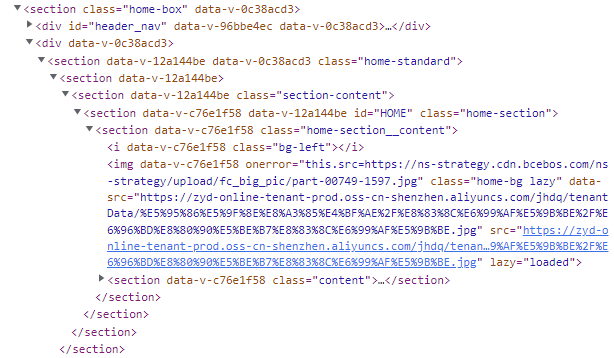
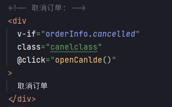

# 代码审查规范

## HTML

参考：[https://codeguide.bootcss.com/](https://codeguide.bootcss.com/)

HTML注重语义化，语义化为前端基础知识，具体可以往[MDN Web Docs](https://developer.mozilla.org/zh-CN/docs/Glossary/Semantics)了解。

主要结果也要**符合W3C标准**验证（框架内部自带HTML Validate），这个也属于前端开发基础，这里不会细讲。

比如PC项目的首页代码，例如这种 `<section>` 标签的嵌套就不符合要求（按照标准，`<section>` 标签下需要有`<h2>`-`<h6>` ）。



## CSS

参考：[https://codeguide.bootcss.com/](https://codeguide.bootcss.com/)

除了参考的内容，这回内置了 `stylelint` 作为代码审查，启用了下面几条规则：

- [`stylelint-config-standard`](https://github.com/stylelint/stylelint-config-standard)：基础 CSS 要求
- [`stylelint-config-recommended-vue`](https://github.com/ota-meshi/stylelint-config-recommended-vue)：基础 CSS 要求 Vue 版本
- [`stylelint-config-recess-order`](https://github.com/stormwarning/stylelint-config-recess-order)：CSS 属性值排序

除了规则之外，还有几点限制：

- CSS 使用 `module` 模式而非 `scope` 模式
- 优先使用 [Tailwind CSS](https://tailwindcss.com/)，减少手写样式
- 尽量不要嵌套 .class
- Flex 布局和 Grid 布局，避免滥用 Float 布局和 Position
- 正确使用Display的属性
  - `display:inline` 后不应该再使用`width`、`height`、`margin`、`padding` 以及 `float`
  - `display:inline-block` 后不应该再使用 `float`
  - `display:block` 后不应该再使用 `vertical-align`
  - `display:table-*` 后不应该再使用 `margin` 或者 `float`
- 不要使用Web字体，改用svg代替
```vue
<template>
  <copy-icon />
</template>

<script>
import CopyIcon from '@/assets/icons/copy.svg?inline';

export default {
  components: {
    CopyIcon,
  },
};
</script>
```
- 鼓励使用 BEM 和 OOCSS（使用时允许开启下划线`_`命名）

BEM 和 OOCSS 可以参考[这篇文档](https://github.com/airbnb/css#oocss-and-bem)

## JS/Vue/Nuxt

这一期着重检查**命名**，要求是避免拼写错误（这个对CSS也是一样的）



ESLint为**强制规范**，有以下规范：

- [`eslint-config-airbnb`](https://airbnb.io/javascript/)：JS代码风格
- [`eslint-plugin-vue`](https://cn.vuejs.org/v2/style-guide/)：Vue代码风格，这里使用的是指南里的“优先级C”

## 约定式提交

完全参考 [conventional commits](https://www.conventionalcommits.org/zh-hans/v1.0.0/)
